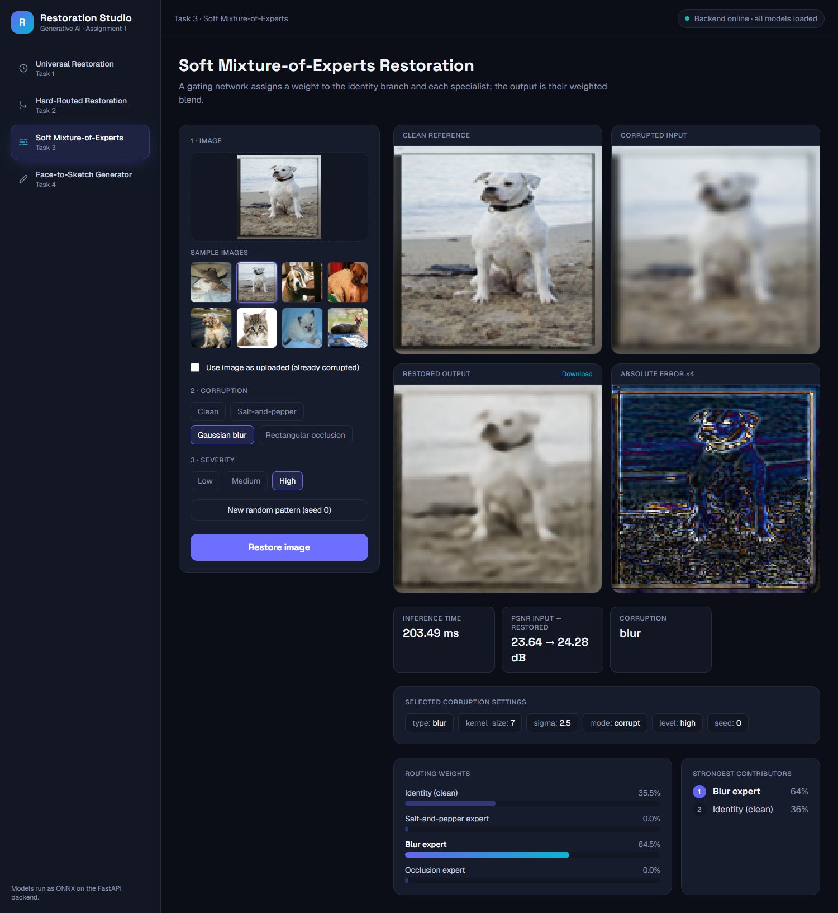
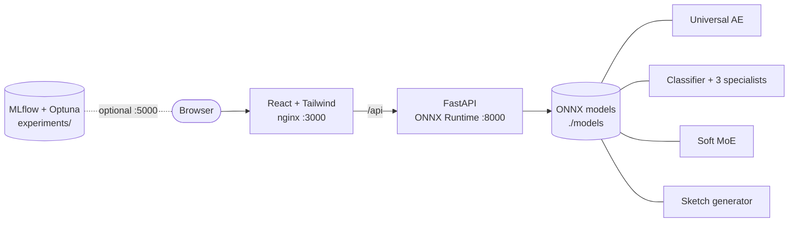
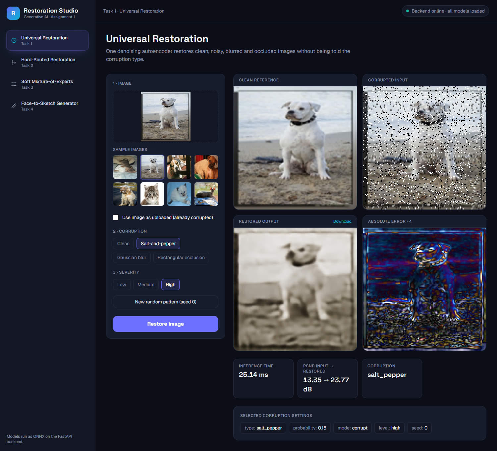
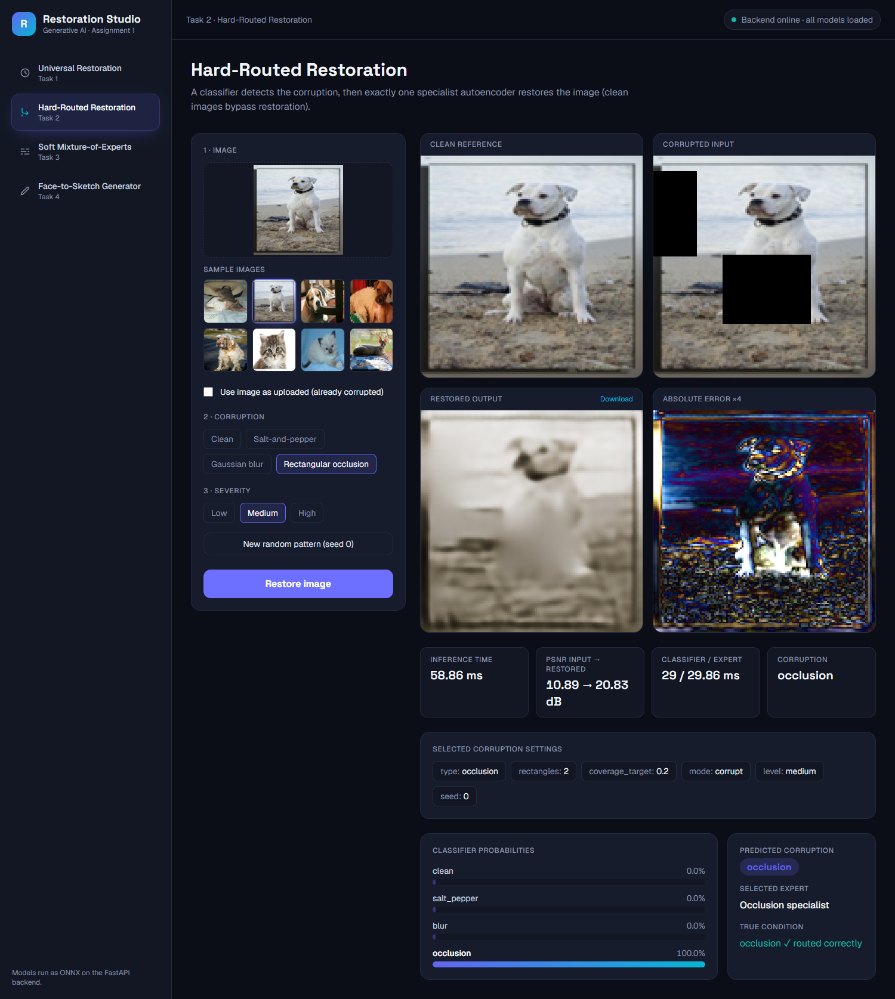
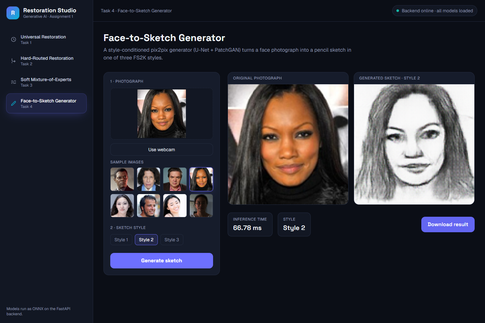
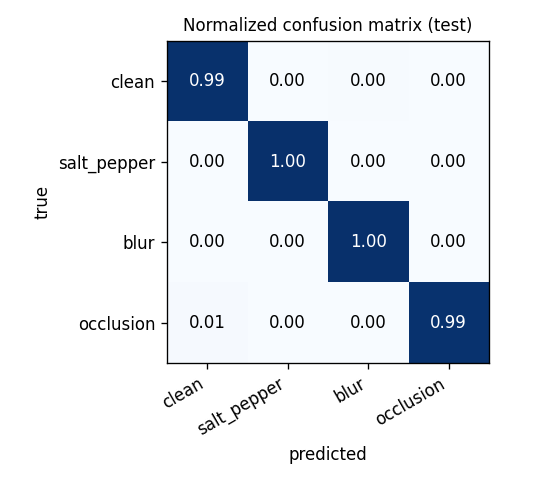
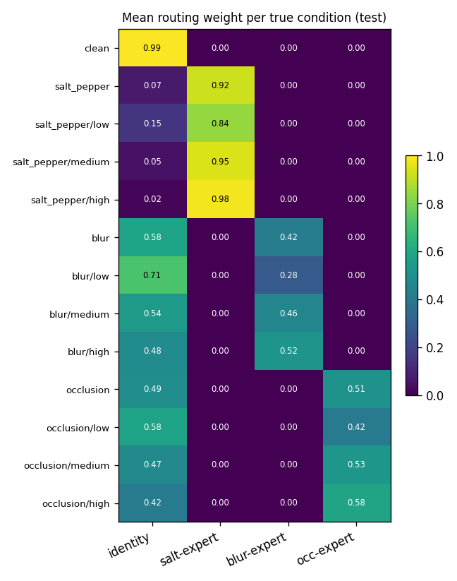
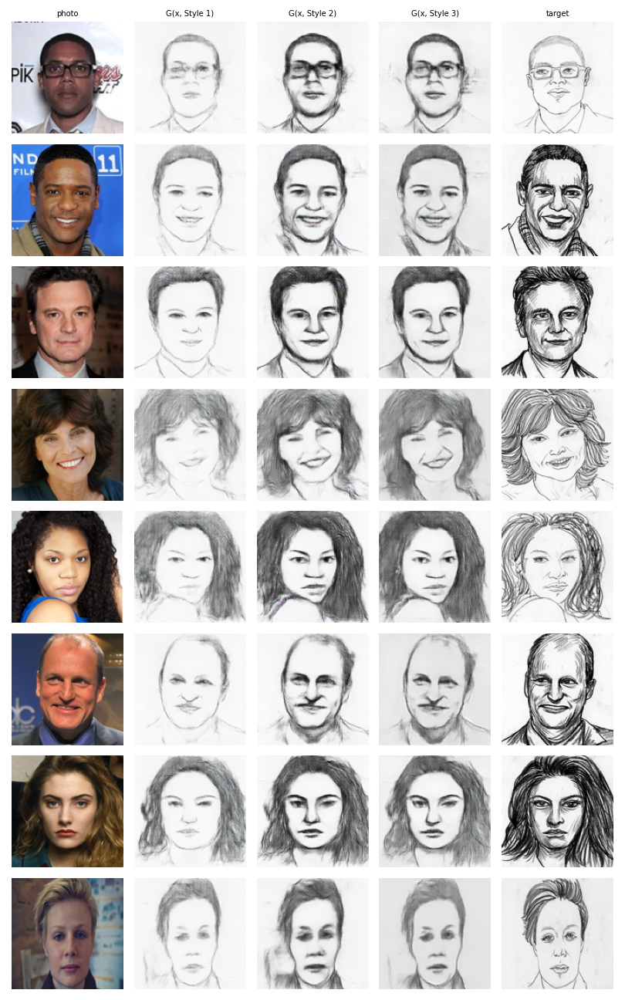

<div align="center">

# Restoration Studio

### Universal, hard-routed and soft mixture-of-experts image restoration, plus style-conditioned face-to-sketch generation, in one browser application

[](https://github.com/MusaxKhan/Restoration-GAN/actions/workflows/ci.yml)


**[Demo video](https://youtu.be/vkmMOKHuCu4)** &nbsp;|&nbsp;
**[Technical report](report/main.pdf)** &nbsp;|&nbsp;
**[Trained models (release v1.0)](https://github.com/MusaxKhan/Restoration-GAN/releases/tag/v1.0)** &nbsp;|&nbsp;
**[Stitch design](docs/stitch/README.md)**

<br>



</div>

---

## Overview

*Generative AI - Assignment 1.* Four related generative systems share one data protocol and one web interface:

| Task | System | Workspace in the app |
|:---:|---|---|
| **1** | Universal multi-corruption denoising autoencoder (L1 + SSIM, genuine bottleneck, no skip connections) | **Universal Restoration** |
| **2** | Corruption classifier + three specialist autoencoders, hard routing with identity bypass | **Hard-Routed Restoration** |
| **3** | Jointly fine-tuned soft mixture-of-experts (gate + identity + 3 experts, balance loss) | **Soft Mixture-of-Experts** |
| **4** | Style-conditioned face-to-sketch cGAN (U-Net generator, PatchGAN discriminator) | **Face-to-Sketch Generator** |

Tasks 1-3 use the **Oxford-IIIT Pet** dataset (128x128, 80/20 split of trainval with seed 42, corruptions generated at run time,
deterministic validation/test manifests). Task 4 uses **FS2K** (official train/test, 15 % stratified validation, seed 42).
Everything is trained with **PyTorch**, tuned with **Optuna**, tracked with **MLflow**, exported to **ONNX** (verified against
PyTorch) and served by a **FastAPI** backend with a **React + Tailwind** frontend that was designed first in Google Stitch.



## Quick start (Docker)

```bash
git clone https://github.com/MusaxKhan/Restoration-GAN.git
cd Restoration-GAN
python scripts/download_models.py        # fetch the ONNX models into ./models  (see "Model files" below)
docker compose up --build                # starts backend (:8000) and frontend (:3000)
```

Open **http://localhost:3000**. API docs: http://localhost:8000/docs, health: http://localhost:8000/api/health.
The header badge turns green when the backend is up and all seven ONNX models are loaded.

### Model files

The trained ONNX models (`universal_ae`, `classifier`, `specialist_salt|blur|occ`, `soft_moe`, `sketch_generator`, about 270 MB in
total) are too large for the repository. They are published as the release asset `models_final.zip` of this repository
(link in `models/SOURCE.txt`, description in [`models/README.md`](models/README.md)). `python scripts/download_models.py`
downloads and unpacks them into `models/`; alternatively download the zip manually and unzip it there.
`models/onnx_verification.json` records the PyTorch-vs-ONNX comparison (max abs. difference < 4e-6 for every model).

### Experiment-tracking UI (MLflow)

All runs and Optuna trials are recorded in `experiments/mlflow.db`. To browse them:

```bash
docker compose --profile tracking up mlflow     # http://localhost:5000
```

(or without Docker: `pip install mlflow && mlflow ui --backend-store-uri sqlite:///experiments/mlflow.db`)

## The application

<table>
<tr>
<td width="50%"><br><sub><b>Universal Restoration</b> - input, restored output, error map, settings, timing</sub></td>
<td width="50%"><br><sub><b>Hard-Routed Restoration</b> - classifier probabilities, selected expert</sub></td>
</tr>
<tr>
<td width="50%"><br><sub><b>Soft Mixture-of-Experts</b> - four routing weights, strongest contributors</sub></td>
<td width="50%"><br><sub><b>Face-to-Sketch Generator</b> - upload or webcam, Style 1/2/3, download</sub></td>
</tr>
</table>

Endpoints: `GET /api/health`, `GET /api/samples`, `POST /api/universal`, `POST /api/hard-route`, `POST /api/soft-moe`,
`POST /api/sketch`. The backend validates uploads, resizes to 128x128, applies the chosen corruption with the same algorithm as
training, runs the ONNX models and returns the images, routing information and timings.

## Results at a glance

Official test sets, final models (all numbers are produced by the evaluation scripts in `results/`):

| Task | Model | Test result |
|:---:|---|---|
| 1 | Universal denoising AE (spatial 2,048-number latent, no skips) | **21.23 dB / SSIM 0.723** (input 22.33 dB / 0.671) |
| 2 | Corruption classifier | accuracy **0.9963**, macro-F1 **0.9939** |
| 2 | Hard-routed restoration (oracle = predicted routing) | **24.79 dB / SSIM 0.753** |
| 3 | Soft mixture-of-experts (joint fine-tuning) | **26.28 dB / SSIM 0.814** |
| 4 | Style-conditioned face-to-sketch cGAN | L1 **0.102**, 15.91 dB, SSIM 0.493 (n = 1,046) |

A first run with a dense (fully-connected) bottleneck is kept as an ablation in `results/dense_baseline`
(Task 1: 18.37 dB / 0.454). Tables, failure cases and the gate analysis are in the [technical report](report/main.pdf)
(source: `report/main.tex`).

<table>
<tr>
<td width="33%"><br><sub>Task 2 - normalised confusion matrix</sub></td>
<td width="33%"><br><sub>Task 3 - gate weights per corruption and severity</sub></td>
<td width="33%"><br><sub>Task 4 - same photographs, Style 1/2/3</sub></td>
</tr>
</table>

## Repository layout

```
restoration/           PyTorch code: data/, models/, losses, training, Optuna, evaluation, ONNX export
  data/                corruptions.py, pets.py (split, manifests, datasets), fs2k.py
  train_ae.py          Task 1 universal AE and Task 2 specialists
  train_classifier.py  Task 2 classifier           routing.py  hard routing
  train_moe.py         Task 3 soft MoE             train_gan.py  Task 4 cGAN
  optuna_*.py          one Optuna study per task   evaluate_task{1..4}.py   final test evaluation
  export_onnx.py       ONNX export + consistency check
manifests/             fixed validation/test corruption manifests, split indices
configs/               best Optuna configurations (JSON, with full search space and trial tables)
experiments/           MLflow database and Optuna studies
notebooks/             colab_training.ipynb (the exact training run)
backend/               FastAPI app (+tests), Dockerfile       frontend/   React + Tailwind, nginx, Dockerfile
docs/stitch/           Google Stitch design evidence          results/    metrics, figures, MLflow export
report/                IEEE LaTeX technical report
docker-compose.yml     one-command deployment
```

## Reproducing the experiments

Data is **not** stored in the repository. Oxford-IIIT Pet downloads automatically (torchvision); FS2K must be placed in
`data/FS2K` (folders `photo/`, `sketch/` and `anno_train.json`, `anno_test.json`; set `DATA_ROOT` to change the root).

```bash
pip install -r requirements.txt
python -m restoration.data.make_manifests          # deterministic val/test corruption manifests (already committed)
python -m pytest tests -q                          # data / model / GAN unit tests
python -m restoration.optuna_ae --mode universal --trials 20            # Task 1 search -> configs/ae_universal_best.json
python -m restoration.train_ae --task universal --config configs/ae_universal_best.json --out runs/task1 --epochs 60
python -m restoration.evaluate_task1 --ckpt runs/task1/best.pt --out results/task1
```

Tasks 2-4 follow the same pattern (see `notebooks/colab_training.ipynb`, which contains every command that produced the
reported results, in order). Experiments are logged to MLflow:

```bash
mlflow ui --backend-store-uri sqlite:///mlflow.db     # parameters, curves, checkpoints, sample images
```

## Tests

```bash
python -m pytest tests -q                              # data pipeline, models, GAN
MODEL_DIR=models python -m pytest backend/tests -q     # API (model tests skip when ONNX files are absent)
```

GitHub Actions (`.github/workflows/ci.yml`) runs the unit tests, builds both Docker images and smoke-tests the running stack.

---

<div align="center">
<sub>Generative AI - Assignment 1 &nbsp;|&nbsp; Musa Khan &nbsp;|&nbsp; <a href="https://youtu.be/vkmMOKHuCu4">Demo video</a></sub>
</div>
